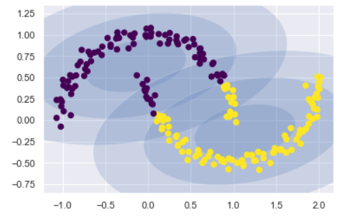

### Clusters de mélange gaussien, clustering (GMM)

Fréquemment utilisés en classification automatique, l’algorithme GMM (Mélange
gaussien) permet de déterminer les différents clusters en séparant les données
contenues dans les différentes courbes en forme cloche.

C'est un modèle statistique exprimé selon une densité mélange. Il sert à estimer
paramétriquement la distribution de variables aléatoires en les modélisant comme
une somme de plusieurs gaussiennes (appelées noyaux). Il s'agit alors de
déterminer la variance, la moyenne et l'amplitude de chaque gaussienne. Ces
paramètres sont optimisés selon un critère de maximum de vraisemblance pour
approcher le plus possible la distribution recherchée.

-   **Avantage** : Les clusters GMM sont intéressqnts quand les clusters ne sont
    pas circulaire comme les K-means, le model GMM essaiera de trouver une
    probabilité de distribution multi-dimensionnelle.

~~~~~~~~~~~~~~~~~~~~~~~~~~~~~~~~~~~~~~~~~~~~~~~~~~~~~~~~~~~~~~~~~~~~~~~~~~~~~~~~

~~~~~~~~~~~~~~~~~~~~~~~~~~~~~~~~~~~~~~~~~~~~~~~~~~~~~~~~~~~~~~~~~~~~~~~~~~~~~~~~
